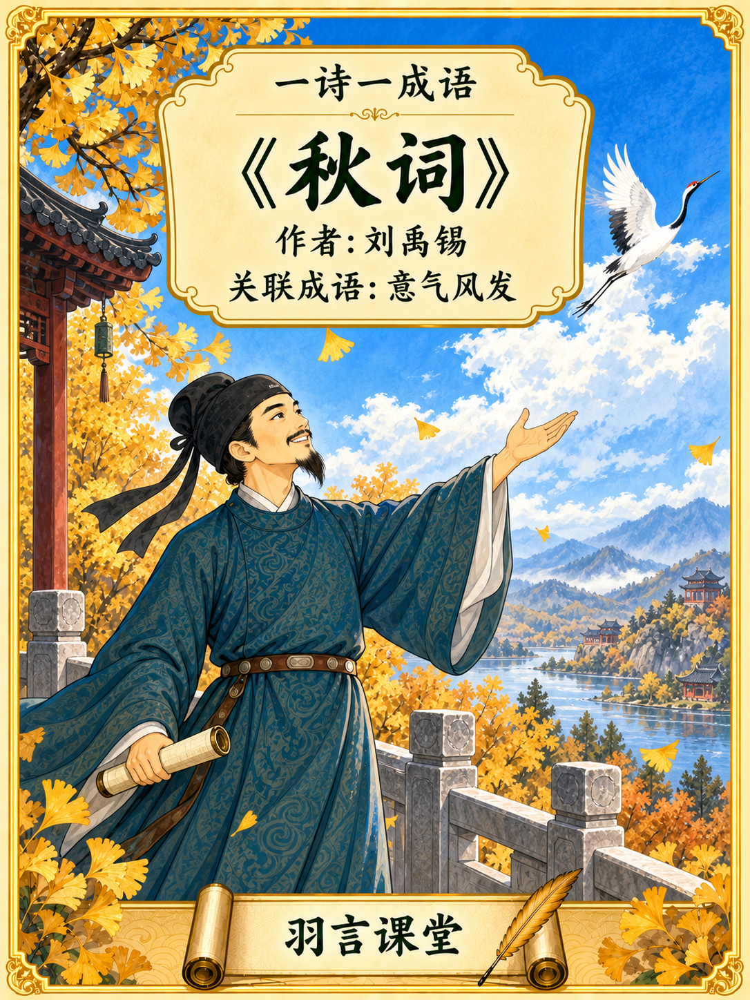
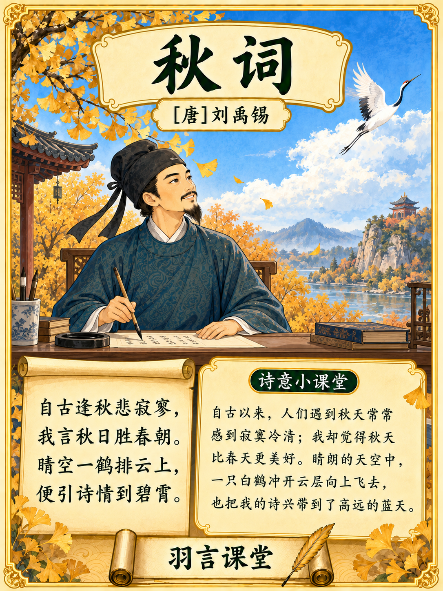
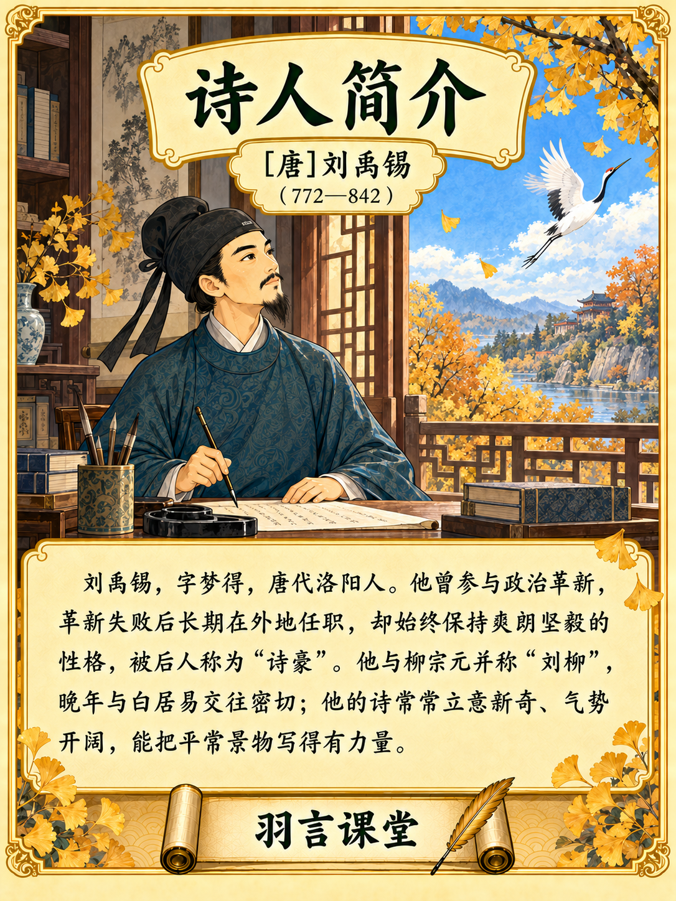
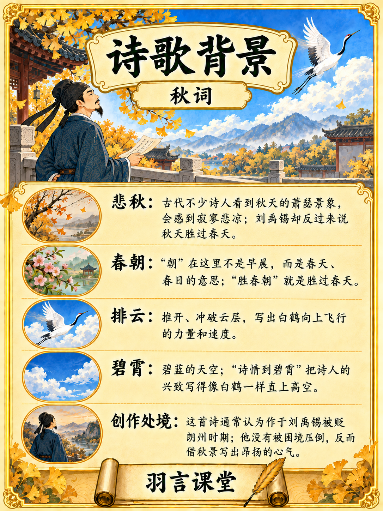
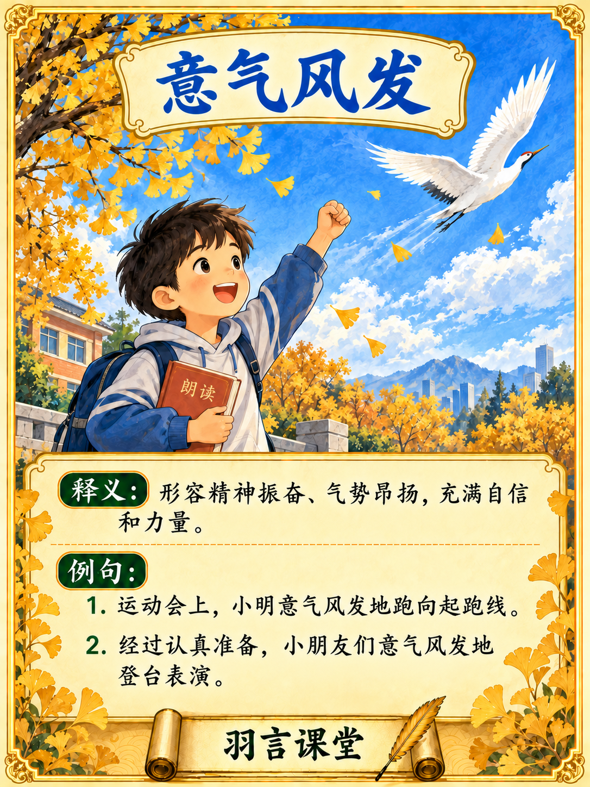

# Poetry Learning Cards

`poetry-learning-cards` is a Codex skill for creating illustrated Chinese poetry learning series for `羽言课堂`. It replaces the former `chinese-poetry-card` skill.

The audience is parents reading together with children.

## What it creates

For each poem, the skill produces a cover plus a matched four-card series in a portrait 3:4 format:

0. **封面** — `一诗一成语`, poem title, author with dynasty (for example, `作者：[唐]刘禹锡`), related idiom, and `羽言课堂`.

1. **诗歌学习卡** — the complete poem and a simple plain-language meaning.
2. **诗人简介卡** — an integrated introduction to the poet, including a memorable, source-supported distinction and a short description of poetic style.
3. **诗歌背景卡** — non-obvious historical, geographic, cultural, and literary context that helps parents explain the poem.
4. **成语学习卡** — a related idiom with a child-friendly definition and examples from daily life.

The four cards are complementary rather than repetitive: poem → poet → hidden context → modern idiom use. The cover introduces the series and is posted first.

## Visual reference: 秋词 reference cards

The five reference cards below show the intended visual language, information hierarchy, portrait 3:4 layout, gold frame, paper panels, illustration style, and `羽言课堂` branding. New poem sets should follow this structure while using their own verified poem text, poet design, background, and idiom.

### 0. 封面



### 1. 诗歌学习卡



### 2. 诗人简介卡



### 3. 诗歌背景卡



### 4. 成语学习卡



## Design principles

- Deliver each card at exactly **1080 × 1440 px**.
- Use the available `imagegen` skill and built-in ImageGen to generate text and artwork together in each card; do not add text as a separate overlay.
- Design the poet according to their age, personality, and historical context; do not copy the reference character.
- Keep the first three cards visually continuous in their poet, period, and classical setting.
- Use a modern child-centered scene for the idiom card while retaining the series frame and brand system.
- Use simple, concrete language suitable for parents reading with children.
- Prefer familiar, imageable idioms; avoid unnecessarily rare, abstract, or allusion-heavy choices.
- Keep poem meaning separate from historical background so each card has a distinct purpose.
- Verify historical claims and distinguish primary sources, later records, modern scholarship, and disputed traditions.

## Skill contents

```text
skills/poetry-learning-cards/
├── SKILL.md
├── agents/openai.yaml
├── assets/qiuci-reference/   # five 秋词 visual references
└── references/
    ├── card-contract.md
    ├── research-and-sourcing.md
    ├── visual-system.md
    └── validation.md
```

The 秋词 reference images establish visual treatment and information architecture. New poems use their own verified text, characters, facts, scenes, and idioms.

## Use and validation

Copy `skills/poetry-learning-cards/` into your Codex skills directory and invoke:

```text
用 $poetry-learning-cards 制作《秋词》五张学习卡。
```

The environment must provide the `imagegen` skill and image-generation capability.

Inspect generated Chinese text character by character for typos, malformed characters, omissions, repetitions, and garbled text. OCR may assist visual review. Correct errors using ImageGen and recheck the whole card. Read actual image dimensions before delivery.

Save each set under `outputs/poetry-learning-cards/<诗人>_<诗题>/`, including its research, source text, prompts, generated assets, and previews. The skill specifies the owner's local project path; users elsewhere should provide their own destination.

## Outputs not included in the core skill

A4 printing layouts and narrated videos are downstream exports. A series cover is part of the core five-image deliverable; platform-specific 9:16 cover variants remain downstream exports. All exports should be generated from the verified set without changing card content.

## License

This project is available under the [MIT License](LICENSE).
